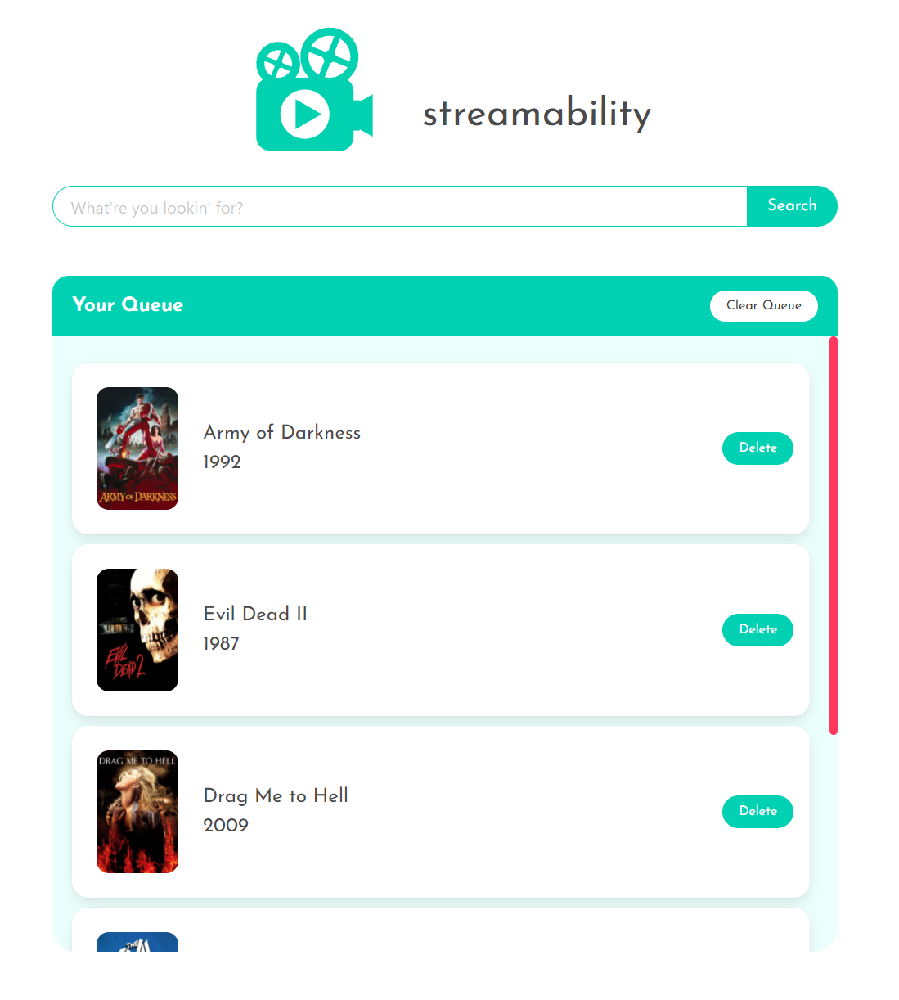

# Streamability

Made by [Leithen Crider](https://github.com/Thenlie), [Kevin Fan](https://github.com/Yu-ChengFan), [Benjamin Holt](https://github.com/Thorulfr), and [Tyler Norman](https://github.com/t-norm).

## Description

Streamability is a collaborative application whose purpose is threefold:

1. Provide users with information about any given film/TV show and indicate where these can be streamed;
2. Suggest titles similar to the searched-for film/show; and
3. Create a queue of films and shows to watch across _all_ streaming providers, rather than creating individual queues per provider.

In creating this application, we used the following user story and acceptance criteria:

## User Story

```
AS AN individual who streams entertainment
I WANT to search for movies and TV shows across all streaming providers and find title suggestions
SO THAT I can create a queue of shows and movies to watch regardless of where said shows/movies are streamable.
```

## Acceptance Criteria

```
GIVEN I want to find movies and TV shows to stream
WHEN I search for a movie or TV show
THEN I am shown a list of TV/film results relating to my search terms
WHEN I select a result from this list
THEN I am presented with a result page containing information about the selected title
WHEN I peruse the result page
THEN I find the title's release year, viewer rating, film/show poster, streaming locations, and suggestions for similar titles
WHEN I click on a suggested title
THEN I shown a search for that title so I can select the result I want
WHEN I am viewing an individual title
THEN I have the option to add that title to my global watch queue
WHEN I add items to my queue
THEN my queue is stored locally to remain persistent, even if I close the page
WHEN I have items in my watch queue
THEN this queue is displayed on both the landing page and individual result pages
WHEN I click on a title in my queue
THEN I am taken to the result page for that title
WHEN I click "Delete" on an individual queue item
THEN that item is removed from my queue
WHEN I click "Clear Queue"
THEN my entire queue is emptied
WHEN I select a theme from the themes menu
THEN the display of the page changes accordingly
WHEN I have selected a theme
THEN that theme remains persistent until I change it again, even if I close the page
WHEN I hover over interactive elements
THEN the styling of those elements changes to indicate that interactiveness to users
WHEN I resize the page or view the site on various screens and devices
THEN I am presented with a responsive layout that adapts to my viewport
```

## Built With

-   HTML
-   CSS
-   JavaScript
-   Express
-   Bulma
-   The Movie Database

## Website

<https://streamability.herokuapp.com/>

## Screenshot



## Contribution

Code by [Leithen Crider](https://github.com/Thenlie), [Kevin Fan](https://github.com/Yu-ChengFan), Benjamin Holt, and [Tyler Norman](https://github.com/t-norm).
